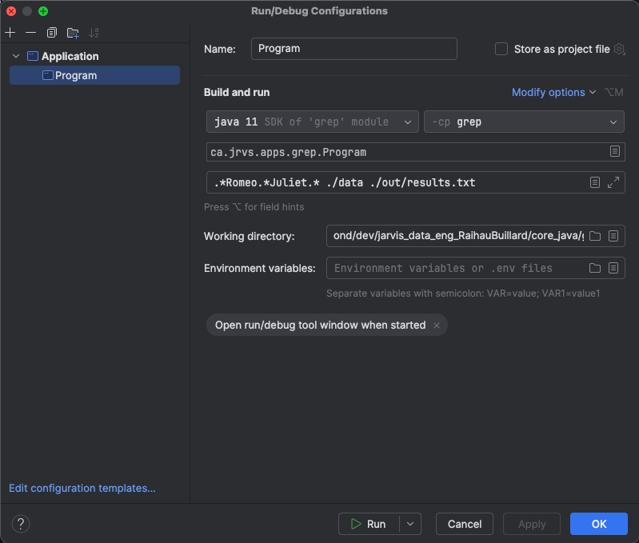

# Introduction
This project aims to replicate the functionality of the egrep command in Java. Named "grep," 
this application filters text within .txt files based on a specified regex pattern. 
It accepts three arguments: the regex pattern, the directory containing the .txt files, 
and the destination file for storing the filtered lines. 
The project serves as an excellent introduction to Java, 
utilizing various technologies such as Maven for dependency management. 
To enhance performance, streams and lambdas are employed for efficient data processing. 
Additionally, the project includes Docker compatibility, facilitating deployment and scalability. 


# Quick Start
There is three different ways to use the app, the first one is by using an IDE. 
In this context, I'm using IntelliJ, but it can also be used with another IDE such as Eclipse.



The second way is to use the terminal to run these commands :
```shell
#Approach 1: Classpath and class files
java -classpath target/classes ca.jrvs.apps.grep.JavaGrepImp .*Romeo.*Juliet.* ./data /out/grep.txt

#Approach 2: Jar file
java -cp target/grep-1.0-SNAPSHOT.jar ca.jrvs.apps.grep.JavaGrepImp .*Romeo.*Juliet.* ./data ./out/grep.txt
```
The third way is also to use the terminal but this time to run a docker container :
```shell
docker run --rm -v `pwd`/data:/data -v `pwd`/log:/log username/grep .*Romeo.*Juliet.* /data /log/grep.out
```

# Implemenation
## Pseudocode
The pseudocode describes a method named process that performs file processing and handles potential IOException. 
It begins by listing all files in a specified root directory. 
It then reads and processes the lines of these files safely, flattening the results into a single list of matched lines. 
Finally, it writes the collected matched lines to an output file.
```text
Method process throws IOException:
    Initialize filesUnderRootDir as a stream of files by calling listFiles with rootPath
    Initialize matchedLines as a list of strings by:
        - Flattening the stream filesUnderRootDir using the method readLinesSafe
        - Collecting the flattened stream into a list
    Call writeToFile with matchedLines as the argument
```

## Performance Issue
There is two main functions that are used to run the application.
The first one is called `listFilesRecursively`, it traverses a large directory tree, 
collecting all file paths into a list, which can consume a substantial amount of memory if the directory contains a vast number of files. 
Similarly, the second function `readLines` reads lines from a file and stores them in a list, 
which can be problematic for large files because it loads all matching lines into memory at once. 
This can lead to high memory usage and possible `OutOfMemoryError` when processing large 
directories or files. Using streams can help solve these problems by processing data incrementally as needed, 
which reduces memory usage and enhances performance.

# Test
To test the application, two different folders are used, one is for storing sample data and the other is
for the destination file. The data folder is the root directory to use as the second argument of 
the application. Inside this directory, there is a 'txt' folder containing a sample data file in .txt format. 
The destination folder is where the filtered lines will be aggregated into a new .txt file.
During testing, logging was implemented to track the data retrieval process, 
ensuring each step executed correctly. Following successful testing, 
the logging functionality was removed.

# Deployment
To Dockerize the application, a Dockerfile was created with the following content:

```text
FROM openjdk:8-alpine
COPY target/grep*.jar /usr/local/app/grep/lib/grep.jar
ENTRYPOINT ["java","-jar","/usr/local/app/grep/lib/grep.jar"]
```
The process starts with the openjdk:8-alpine base image, which provides a lightweight Java runtime environment.

The built JAR file, matching the pattern grep*.jar, is copied from the target 
directory of the build context to /usr/local/app/grep/lib/grep.jar within the container's file system.

The ENTRYPOINT instruction specifies the command to run the application. 
It uses the java command to execute the JAR file located at /usr/local/app/grep/lib/grep.jar.

This setup ensures that the Java application is packaged within a Docker container, allowing it to be easily deployed and run in any environment with Docker installed.

# Improvement
- Implement streaming APIs to process files incrementally, reducing memory usage and improving performance for large datasets.
- Enhance logging capabilities to provide detailed insights into application execution, facilitating easier debugging and monitoring of operations.
- Optimize the Docker image by using multi-stage builds and lightweight base images, and enhance security measures to ensure a more secure deployment environment.