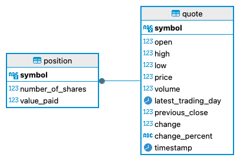

# Introduction
This project is a simplified version of a stock wallet/portfolio. 
It is a console application that provides a straightforward interface for managing 
your own stocks. Users can buy and sell stocks and view the latest quote details 
before making any purchase. After buying shares, the transaction is automatically 
saved in a PostgreSQL database. When selling stocks, users can compare the total 
value of their holdings with the current quote price to make informed decisions.


# Implementation
## ER Diagram

## Design Patterns
The Data Access Object (DAO) and Repository patterns are crucial for managing data operations and interactions 
with databases in a structured manner. In the provided context, the PositionDAO and 
QuoteDAO classes utilize the DAO pattern, which abstracts and encapsulates all access 
to the data source. This separation of concerns ensures that the rest of the application 
remains unaware of the database specifics, promoting a more modular and maintainable 
codebase.

The DAO pattern defines a clear contract for performing CRUD (Create, Read, Update, Delete) 
operations on specific entities, such as Position and Quote. Each DAO class handles 
database connections, SQL queries, and data transformations, isolating these 
responsibilities from the business logic. This simplification aids in testing and 
maintaining the application.

The Repository pattern is a higher-level abstraction that manages collections of objects, 
providing a domain-centric view of data operations. In our context, 
the DAOs serve as repositories by offering methods to save, find, and delete Position and 
Quote objects. This aligns with Domain-Driven Design (DDD) principles, 
where repositories represent a meaningful collection of objects, facilitating better 
separation of concerns.

By implementing these patterns, we ensure a clean architecture that enhances code 
readability, testability, and scalability, ultimately leading to a more robust and 
maintainable application.

# Test
Testing the application against the database involves both unit and integration tests to 
ensure functionality and reliability. For unit testing, we mock dependencies to isolate and 
test individual components. For instance, in the QuoteServiceTest, the QuoteDAO and 
QuoteHttpHelper are mocked to test the service logic without involving actual database 
interactions. This allows us to validate scenarios such as fetching quotes from the database
or an API and handling up-to-date checks efficiently.

Integration testing, on the other hand, involves actual database operations to ensure 
the correct implementation of data access methods. The QuoteDaoTest demonstrates 
this by connecting to a PostgreSQL database, inserting test data, and validating CRUD 
operations. Setup and teardown methods ensure a clean state before and after each test, 
preventing interference between tests. The tests cover saving quotes, checking for 
existing quotes, retrieving quotes by ID, retrieving all quotes, and deleting quotes, 
ensuring comprehensive coverage of the DAO functionality.

By combining unit and integration tests, we ensure both the correctness of the business 
logic and the reliability of database interactions, providing a robust testing strategy 
for the application.

# Deployment
### First approach
These are the necessary steps to run the application with docker : 
```shell
export SECRET_API_KEY=your_api_key
docker run --name stock-psql -e POSTGRES_PASSWORD=passwrd -d -v stock-data:/var/lib/postgresql/data -p 5432:5432 postgres:9.6-alpine
psql -U postgres -d postgres -h localhost -f sql/stock_quote.sql
docker build --build-arg SECRET_API_KEY=${SECRET_API_KEY}  -t stock .
docker network create stock-network
docker network connect stock-network stock-psql
docker run --name stock-app -it --network stock-network stock
```
The first step is to create an environment variable that contains the API key required to fetch quote data from the Alpha Avantage API.

Next, we set up the database container using a PostgreSQL image pulled from Docker Hub. 
We configure the container by setting the password, container name, volume, 
and port for the connection. We then initialize the database by executing a SQL script 
to create the necessary tables.

Afterward, we build the Docker image for our application based on the Dockerfile, 
specifying the API key as an argument. Before running the application, 
we create a network to connect our application and database containers. 
The final step is to run the application container, allowing us to use the stock 
quote application.

#### To re run the program from the container
docker start stock-app
docker exec -it stock-app java -jar /app/stock/lib/jdbc.jar

### Second appraoch
To simplify the process, the project also contains a docker-compose.yml file to automatically run our application.
There is only two commands to run to execute our app.
```shell
docker-compose up --build -d
docker-compose run app
```

#### Command to remove all the containers and networks:
```shell
docker-compose down
```
Note : add -v if you want to remove the volumes too


