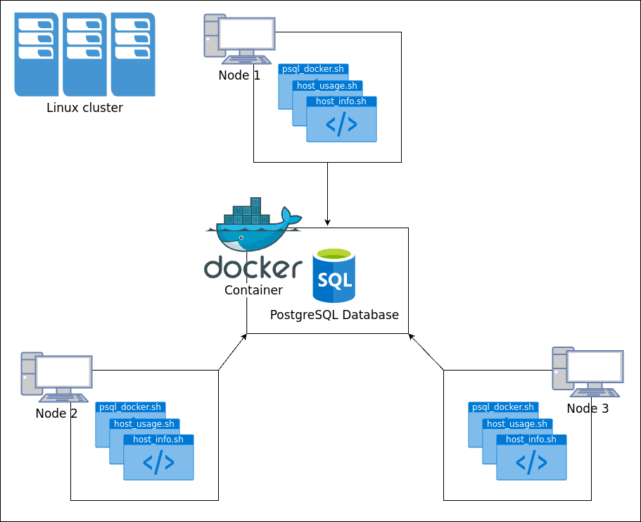

# Introduction

The Linux Cluster Monitoring Project automates the monitoring and management of hardware 
resources across multiple Linux machines. Using Bash scripting and Docker containers, 
the project gathers hardware specifications and monitors resource usage, storing data in a PostgreSQL database.
This initiative aims to improve system monitoring for IT professionals, 
facilitating efficient resource allocation and proactive maintenance in cluster environments. 
By centralizing data collection and utilizing containerization, the project ensures scalability 
and reliability in maintaining system health and performance.

# Quick Start
### Start PostgreSQL Docker Container:
```markdown
./scripts/psql_docker.sh create [user_name] [db_password]
```
This script pulls the PostgreSQL Docker image and creates and starts a container with the 
specified database credentials.

### Create Database Tables:
```markdown
psql -h [host_name] -U [user_name] -d [db_name] -f /path/to/ddl.sql
```
Initializes the host_info and host_usage tables in the PostgreSQL database 
to store hardware specifications and resource usage data.

### Insert Hardware Specifications:
```markdown
./scripts/host_info.sh [host_name] [psql_port] [db_name] [user_name] [db_password]
```
Executes Linux commands to gather hardware specifications and inserts them into the host_info table.

### Schedule Data Collection:
```markdown
* * * * * bash /home/[user]/dev/jrvs/linux_sql/scripts/host_usage.sh localhost 5432 host_agent postgres password > /tmp/host_usage.log
```
Configures Crontab to run host_usage.sh script every minute, collecting and inserting real-time resource usage data into the host_usage table.


# Implementation
The Linux Cluster Monitoring Project begins by setting up a PostgreSQL database using a Docker container. 
This container, configured with specific parameters, 
hosts the database instance necessary for storing hardware specifications and resource usage data. 
Following the database setup, the ddl.sql script initializes the host_info and host_usage tables, 
which are essential for storing hardware details and resource metrics, respectively.

To populate these tables, two Bash scripts are employed: 
host_info.sh retrieves hardware specifications from each machine and inserts them into the host_info table, 
while host_usage.sh captures real-time resource usage data and stores it in the host_usage table.

To automate data collection, the project utilizes Crontab to schedule regular executions of host_usage.sh, 
ensuring up-to-date monitoring of system resources across the cluster.

## Architecture


## Scripts

The psql_docker.sh script manages the deployment of a PostgreSQL database within a Docker container. 
It pulls the PostgreSQL image, creates and starts a container with specified configurations, 
and prepares the database environment for hosting hardware specifications and resource usage data.
```markdown
./scripts/psql_docker.sh start|stop|create [user_name][db_password]
```
The host_info script collects hardware specifications from each Linux machine in the cluster and
stores this data in the host_info table of the PostgreSQL database.
```markdown
./scripts/host_info.sh [host_name] [psql_port] [db_name] [user_name] [db_password]
```

The host_usage script collects real-time CPU and memory usage data from each Linux machine
and inserts this data in the host_usage table of the PostgreSQL database.
```markdown
./scripts/host_usage.sh [host_name] [psql_port] [db_name] [user_name] [db_password]
```

## Database Modeling
`host_info` schema :

| Column            | Data Type         | Constraints        | Description                          |
|-------------------|-------------------|--------------------|--------------------------------------|
| `id`              | `SERIAL`          | `PRIMARY KEY`      | Auto-incrementing ID                 |
| `hostname`        | `VARCHAR`         | `NOT NULL`         | Hostname of the machine              |
| `cpu_number`      | `INT2`            | `NOT NULL`         | Number of CPUs                       |
| `cpu_architecture`| `VARCHAR`         | `NOT NULL`         | CPU architecture                     |
| `cpu_model`       | `VARCHAR`         | `NOT NULL`         | Model of the CPU                     |
| `cpu_mhz`         | `FLOAT8`          | `NOT NULL`         | CPU clock speed in MHz               |
| `l2_cache`        | `INT4`            | `NOT NULL`         | Size of the L2 cache                 |
| `timestamp`       | `TIMESTAMP`       | `NULL`             | Timestamp of the entry               |
| `total_mem`       | `INT4`            | `NULL`             | Total memory in MB                   |
| `host_info_pk`    | `CONSTRAINT`      | `PRIMARY KEY (id)` | Primary key constraint on `id`       |
| `host_info_un`    | `CONSTRAINT`      | `UNIQUE (hostname)`| Unique constraint on `hostname`      |

`host_usage` schema :

| Column           | Data Type    | Constraints             | Description                                                    |
|------------------|--------------|-------------------------|----------------------------------------------------------------|
| `host_id`        | `SERIAL`     | `FOREIGN KEY`           | Auto-incrementing ID, foreign key reference                    |
| `memory_free`    | `INT4`       | `NOT NULL`              | Amount of free memory                                          |
| `cpu_idle`       | `INT2`       | `NOT NULL`              | Percentage of CPU idle time                                    |
| `cpu_kernel`     | `INT2`       | `NOT NULL`              | Percentage of CPU time spent in kernel mode                    |
| `disk_io`        | `INT4`       | `NOT NULL`              | Disk input/output operations                                   |
| `disk_available` | `INT4`       | `NOT NULL`              | Available disk space                                           |
| `timestamp`      | `TIMESTAMP`  | `NOT NULL`              | Timestamp of the usage data                                    |
| `host_usage_host_info_fk`   | `CONSTRAINT` | `FOREIGN KEY (host_id)` | Foreign key constraint on `host_id` referencing `host_info(id)` |


# Test
The testing phase of the Linux Cluster Monitoring Project primarily involved manual execution 
and validation of the Bash scripts. Each script (psql_docker.sh, host_info.sh, host_usage.sh) 
was manually launched to ensure correct functionality and data insertion into the PostgreSQL database.
Tests focused on verifying the creation of Docker containers, initialization of database tables 
using ddl.sql, and accurate collection of hardware specifications and resource usage data.

# Deployment
The deployment of the Linux Cluster Monitoring Project includes scheduling recurring tasks using Crontab, 
a Unix utility for automating repetitive tasks. 
In this project, Crontab is used to execute the host_usage.sh script at regular intervals 
on each Linux machine within the cluster, while storing the script's output in a log file for record-keeping and troubleshooting purposes.


# Improvements
- `Error Handling:` Implement more robust error handling within the Bash scripts (psql_docker.sh, host_info.sh, host_usage.sh) 
to manage unexpected conditions and provide informative error messages.

- `Logging Standardization:` Implement standardized logging practices across all scripts 
to uniformly capture and archive script outputs.

- `Automation:` Explore further automation possibilities, 
such as automating database backups or scheduling additional maintenance tasks, 
to enhance operational efficiency and reliability.
